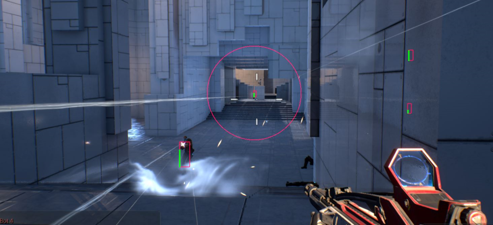
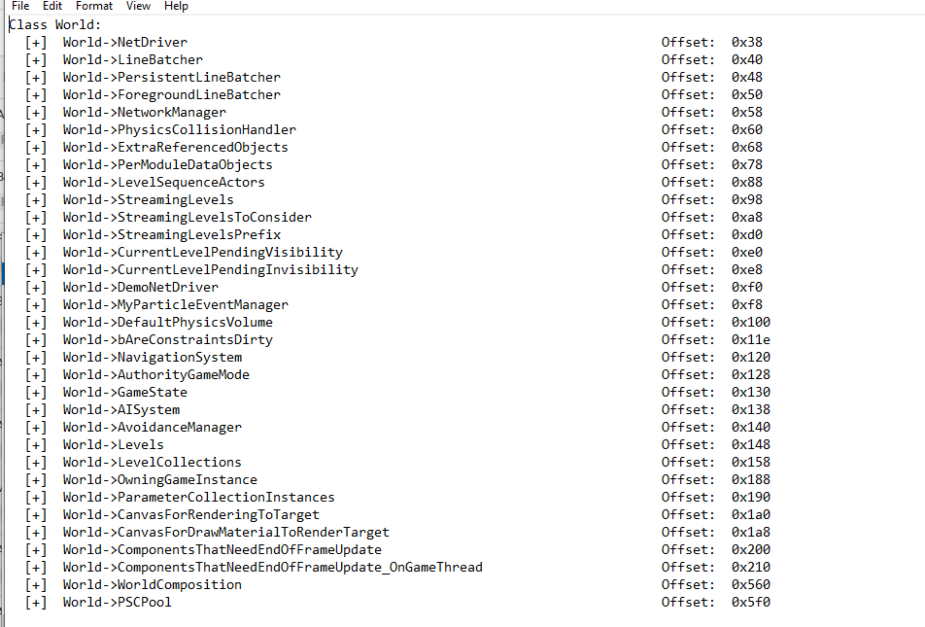

# shootergame-Hack
External UE4 shootergame hack with many features. This is supposed to be a UE4 external base.

Features:
- FOV circle
- smooth mouse aim

ESP features:
- health ESP
- box ESP
- items ESP

## To do list:
1. Automatically dump offsets and actor IDs
2. add line ESP

##  Example UE4 dumper output:

NOTE: some fields aren't included in object or FField list, so they cannot be dumped
